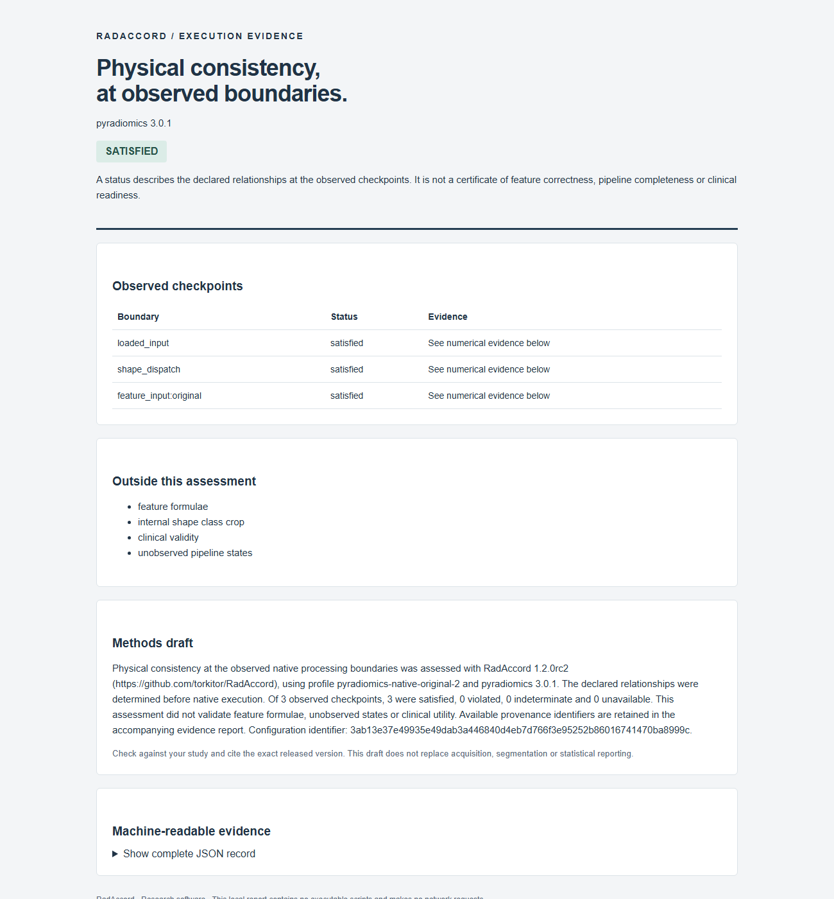

<p align="center">
  
</p>

<p align="center">
  <a href="docs/INSTALL.md"></a>
  <a href="LICENSE"></a>
  <a href="docs/SAMPLING_RESULTS.md"></a>
  <a href="https://github.com/torkitor/RadAccord/stargazers"></a>
</p>

<p align="center">
  <a href="#try-it"><strong>Try it</strong></a> ·
  <a href="#native-integrations"><strong>Native integrations</strong></a> ·
  <a href="docs/SAMPLING.md"><strong>Use your images</strong></a> ·
  <a href="docs/SAMPLING_RESULTS.md"><strong>Inspect the evidence</strong></a> ·
  <a href="#historical-full-grid-profile"><strong>Full-grid profile</strong></a> ·
  <a href="#cite"><strong>Cite</strong></a>
</p>

## Check preprocessing before reusing radiomic measurements.

**RadAccord checks retained source and candidate images against an independently
declared operation.** Image–mask alignment alone can miss a shared origin error
or incorrect sampling. The declared-sampling profile checks crop, padding,
reorientation and nearest-neighbour or linear resampling, then separates three
questions:

| Sampling fidelity | Selected-ROI coverage | Measurement reuse |
| :--- | :--- | :--- |
| Does the candidate follow the declared grid, intensities and ROI sampling? | Does its field of view retain the selected source voxel centres? | Were selected inputs preserved, is reextraction required, or is reuse blocked? |

Correct resampling can change radiomic values. A satisfied sampling check is not
universal feature equivalence, clinical validation or permission to reuse every
measurement. The source and declaration must be trustworthy; numerical boundary
ambiguity and unavailable inputs remain explicit.

This **1.2.0rc3 research candidate** adds an installable package, native integrations,
execution records and a reproduced historical writing regression. Its exact
version is in [CITATION.cff](CITATION.cff). Local verification and remote CI are
distinguished in the [package verification](docs/WHEEL_VERIFICATION.md).
The historical 1.0.0 archive and frozen sampling experiments remain identifiable.

## Native integrations

Keep your extractor and add evidence about its observed physical inputs.
Install the appropriate optional extra in a separate environment, then use:

```python
from radaccord import audit_pyradiomics

result = audit_pyradiomics(
    "image.nii.gz", "mask.nii.gz", label=1,
    config={
        "setting": {"resampledPixelSpacing": [1.3, 1.3, 1.3], "binCount": 32},
        "imageType": {"Original": {}},
    },
)
features = result["features"]  # unchanged native scientific values
evidence = result["report"]
```

| Integration | Observed boundary | Guide |
| :--- | :--- | :--- |
| PyRadiomics | Loaded inputs, shape dispatcher and original-image feature dispatcher | [Python, CLI and supported settings](docs/PYRADIOMICS.md) |
| MIRP | Original image and ROI export after extraction | [Python, CLI and supported settings](docs/MIRP.md) |
| Saved processing pipeline | Source/candidate files at each recorded boundary | [Declared sampling](docs/SAMPLING.md) |

The native extension checks applicable cubic/B-spline, antialiasing and
thresholded mask policies. The second native profiles retain nominal reference
decisions and use a source-derived conditional numerical envelope; unresolved
rounding cases are indeterminate, even when they match the nominal reference.
The envelope has explicit numerical assumptions and is not a certified bound on
an entire backend. MIRP's bounded integer identity profile preserves unchanged
samples; integer resampling remains unavailable. Unsupported configurations and unobserved states
remain explicit. Reports bind source, configuration, implementation and output
hashes to a particular execution. Matching inputs do not validate feature
formulae, unobserved operations or clinical utility.

```bash
radaccord native --engine pyradiomics --image image.nii.gz --mask mask.nii.gz --config settings.json --report evidence.json --html evidence.html --methods methods.txt
```

Read coverage and unresolved obligations alongside the status. Review the
methods draft against your actual study. See the [native study protocol](protocol/native_study.md)
for applicability, exact-value comparisons and complete attempt accounting.
The [first native calibration](data/RadAccord-native-calibration-1.zip) remains
unchanged. The [rc2 refinement](protocol/native_refinement.md) reevaluates reused
inputs after calibration-informed changes; it is not an independent clinical
validation. Both engines completed all 62 pairs in that reevaluation and preserved
their native outputs exactly: **124/124 paired extractions**. Physical evidence
remained explicit: **99 satisfied, 19 indeterminate and 6 unavailable** pair outcomes.
See the [complete native evidence and original failures](docs/NATIVE_EVIDENCE.md).

<details>
<summary><strong>Preview an actual execution report</strong></summary>



[Download the local HTML and JSON example](examples/native_evidence/README.md).
This is a retained synthetic execution; its version and checks remain explicit.

</details>

### A real historical regression

In unmodified MIRP 2.4.1, two oblique NIfTI exports preserved arrays and paired
image–mask alignment but displaced physical coordinates by more than 10 mm.
RadAccord detected both source discrepancies; all three controls passed in the
corrected version 2.4.2. [Reproduce the six cases](docs/MIRP_NIFTI_REGRESSION.md).

This checks the actual writer and is separate from the current in-memory
adapter. It does not imply that current releases retain the defect.
The [incident register](docs/INCIDENTS.md) distinguishes reproduced experiments
from other documented antecedents.

## Try it

Download the [verified 1.2.0rc3 wheel](data/packages/radaccord-1.2.0rc3-py3-none-any.whl)
and follow the [installation guide](docs/INSTALL.md). Its checksum is in
[the download record](data/packages/README.md). No account or patient upload is needed.

The package also provides a small installed demo:

```bash
python -m pip install .
radaccord demo --output ./radaccord-demo
```

Open the generated HTML report. No patient data or native extractor is needed.
The [installation guide](docs/INSTALL.md) covers wheels and native extras.

Open this candidate folder and create an isolated environment. Core CI targets
Python 3.11; the separate native jobs use Python 3.10 and 3.13. The recorded study
environments are described in the protocol and [CI guide](docs/CI.md).

```bash
python -m venv .venv
```

Activate with `.venv\Scripts\Activate.ps1` on Windows PowerShell or
`source .venv/bin/activate` on macOS/Linux, then run:

```bash
python -m pip install -r software/requirements-core.txt
python -B scripts/demo_sampling.py --output outputs/sampling_demo
```

The demo creates small synthetic NIfTI files and checks them through the actual
file interface. A correct crop preserves selected inputs; the subsequent grid
change requires reextraction; an undeclared shared origin shift blocks the
sequence at checkpoint 3. No clinical input, native feature extractor or upload
is needed. Open the generated HTML reports in `outputs/sampling_demo`.

To inspect your own saved preprocessing boundaries:

```bash
python -B radaccord_sampling.py --plan plan.json --report report.json --html report.html
```

Prepare `plan.json` **before** generating the candidate. Supply the intended
candidate-to-source index map, shape, interpolation and outside-value policy;
do not infer intent from candidate geometry. [The sampling guide](docs/SAMPLING.md)
documents the plan, API, tolerances, supported domain, decisions and checkpoint
linkage. Supplied checkpoints can locate an observed discrepancy; they do not
diagnose an unobserved internal cause.

## Evidence retained with this candidate

The sampling protocol was internally frozen before the first reserved and
public-image evaluations. This is a local analysis freeze, not public
preregistration. All attempted cases and inactive faults are retained.

| Sampling evaluation | Reserved synthetic | Public anatomical images |
| :--- | ---: | ---: |
| Released/generated volumes | 32 | 301: 260 MRI + 41 CT |
| Planned and retained operation cases | 448/448 | 4,214/4,214 |
| Valid controls satisfied | 224/224 | 2,096/2,107 |
| Valid controls boundary-indeterminate | 0 | 11 |
| Active wrapper perturbations violated | 190/190 | 1,605/1,605 |
| Inactive perturbations retained | 2 | 201 |
| Correct truncations with lost support and blocked reuse | 32/32 | 301/301 |

The eleven CT abstentions agree with nominal sampling but have differing
nearest-neighbour ROI alternatives within the prespecified boundary band. They
remain blocked and are not observed defects in SimpleITK. Public identifiers do
not establish independent patients; these are descriptive operation counts.

The fixed clinical NIfTI subset has **84/84** agreements with its in-memory
results: 50 satisfied and 34 violated. The eleven indeterminate CT cases lie
outside that subset, and their serialization stability was not tested. A fixed
six-volume native subset completed **30 PyRadiomics extractions and 24 contrasts**.
Correct resampling and deliberately wrong interpolation can both change native
measurements; the references and interpretation remain separate.

[Reserved records](results/sampling_reserved) ·
[Clinical records](results/sampling_clinical) ·
[Native feature records](results/native_feature_subset) ·
[Protocol](protocol/sampling_study.md) ·
[Counts, limitations and replay instructions](docs/SAMPLING_RESULTS.md)

### Replay the sampling summaries

These commands need the bundled derived records, not clinical images or a native
engine. Each output directory must be new.

```bash
python -B scripts/verify_sampling_freeze.py
python -B scripts/summarize_sampling_study.py --input results/sampling_reserved --output reproduced/sampling_reserved
python -B scripts/summarize_sampling_study.py --input results/sampling_clinical --output reproduced/sampling_clinical
```

The freeze check verifies sixteen relocated, byte-preserved files and the
historical scientific ZIP. The summarizer checks IDs, ledgers, recorded arithmetic
and denominators before generating traceable CSV/JSON tables. It does not rerun
preprocessing or validate image correspondence afresh. The CI workflow also
compares generated summaries byte for byte with those retained here.

## Historical full-grid profile

The separate `radaccord.py` entry point retains its **1.0.0** identity and delegates
to the unchanged full-grid/feature verifier. [USAGE.md](USAGE.md) documents its
native engines and applicable feature laws. The original and revised PyRadiomics
profiles remain distinct. The revised profile withholds four mesh-derived
reindexing obligations while retaining their original diagnostics.

<details>
<summary><strong>Original synthetic study and replay</strong></summary>

The immutable archive retains 12 development, 64 initial reserved and 32 follow-up
phantoms. These historical results do not validate the new sampling operators.

| Initial reserved evaluation | PyRadiomics 3.0.1 | MIRP 2.5.0 |
| :--- | ---: | ---: |
| Constructed faults detected by physical correspondence | 512/512 | 512/512 |
| Constructed faults detected by feature laws | 384/512 | 384/512 |
| Constructed faults detected by numerical anchors | 320/512 | 320/512 |
| Equivalent representations with an original-profile alert | 36/3,200 | 0/3,200 |

The PyRadiomics follow-up retains 384/1,598 original-profile alerts and 0/1,598
revised-profile alerts; two further attempts remain outside the input domain.
The four withheld obligations are not verified by the revised result.

```bash
python -B scripts/demo.py
python -B scripts/restore_records.py
python -B reproduce_archived.py --output reproduced/full_grid
```

Restoration verifies the bundled ZIP before extracting its twenty exact JSONL
records. Replay compares ten archived decision/diagnostic/summary files byte for
byte, without native extraction or the omitted large image volumes.

[Original science](docs/SCIENCE.md) ·
[Original reproduction guide](docs/REPRODUCIBILITY.md) ·
[Immutable scientific archive](data/RadAccord-1.0.0.zip)

</details>

## Cite

**RadAccord: software for physical consistency testing before radiomic feature reuse in research**

Cite the version and profile actually used, together with the commit or frozen
source hash, recorded boundary, settings and unverified obligations. This local
candidate has no new DOI or published article citation.

```bibtex
@software{garcia_hidalgo_radaccord_2026,
  author  = {García-Hidalgo, Clemente},
  title   = {RadAccord: software for physical consistency testing before radiomic feature reuse in research},
  year    = {2026},
  version = {1.2.0rc3},
  note    = {Local release candidate; declared-sampling extension not yet published},
  url     = {https://github.com/torkitor/RadAccord}
}
```

[Machine-readable citation](CITATION.cff) ·
[Sampling Methods template](docs/SAMPLING.md) ·
[Full-grid Methods template](USAGE.md#methods-reporting-template)

## License and contributions

RadAccord is maintained by **Clemente García-Hidalgo**
([ORCID](https://orcid.org/0009-0001-6672-2714)) under the
[Apache License 2.0](LICENSE). Dependencies and source datasets retain their own
licenses. Raw clinical images are not distributed in this repository.

Reproducible minimal examples and independently evaluated contracts are welcome;
see [CONTRIBUTING.md](CONTRIBUTING.md). AI tools assisted development, debugging and
documentation; the authors remain responsible for the software, interpretation
and scientific review.
