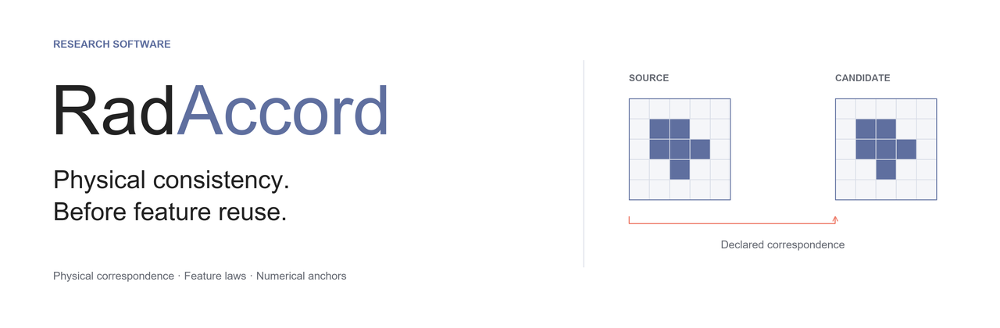
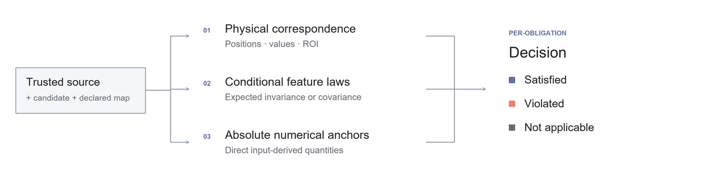

<p align="center">
  
</p>

<p align="center">
  <a href="CHANGELOG.md"></a>
  <a href="LICENSE"></a>
  <a href="docs/REPRODUCIBILITY.md"></a>
  <a href="https://github.com/torkitor/RadAccord/actions/workflows/ci.yml"></a>
  <a href="https://github.com/torkitor/RadAccord/stargazers"></a>
</p>

<p align="center">
  <a href="#try-it"><strong>Try it</strong></a> ·
  <a href="https://github.com/torkitor/RadAccord/archive/refs/heads/main.zip"><strong>Download</strong></a> ·
  <a href="USAGE.md"><strong>Use your images</strong></a> ·
  <a href="docs/SCIENCE.md"><strong>Evidence</strong></a> ·
  <a href="#cite"><strong>Cite</strong></a>
</p>

## A number can agree while its physical location does not.

**RadAccord tests physical consistency before radiomic feature reuse.** Retain a
source image and segmentation, declare the intended transformation, and test the
candidate files before reusing their measurements in research.

A shared origin error in an image and its mask can preserve their mutual alignment
and invariant feature values. RadAccord also checks the candidate against the
retained source in physical coordinates.

| Physical correspondence | Conditional feature laws | Absolute numerical anchors |
| :--- | :--- | :--- |
| Do positions, decoded intensities and the selected ROI follow the declared map? | Do applicable measurements follow their prescribed invariance or scale response? | Do selected measurements agree with quantities calculated directly from the input? |

The report records **satisfied**, **violated** and **not applicable** obligations;
unavailable assessments remain explicit. A satisfactory decision applies to the
assigned checks at the declared file boundary. The source and transformation
record must be trustworthy.

## Try it

The first example freshly reads the included synthetic NIfTI files and tests
physical correspondence. It needs **NumPy and NiBabel**, with no native extractor
or data upload.

```bash
git clone https://github.com/torkitor/RadAccord.git
cd RadAccord
python -m venv .venv
```

Activate the environment with `.venv\Scripts\Activate.ps1` on Windows PowerShell
or `source .venv/bin/activate` on macOS/Linux. Use Python 3.11 for the quick start;
the original scientific environments are documented separately.

```bash
python -m pip install -r software/requirements-core.txt
python -B scripts/demo.py
```

The valid reindexing satisfies physical correspondence. The undeclared origin
change violates it, even though the decoded intensities and ROI correspondence
are preserved. This demo checks the input relationship; it does not run native
radiomic extraction. [Run the complete verifier with an extractor →](USAGE.md)

## From a conversion to a report

<p align="center">
  
</p>

1. **Retain the source.** Keep the image, segmentation and provenance before conversion.
2. **Declare the change.** Supply the intended index, physical and intensity maps.
3. **Run RadAccord.** Provide source/candidate paths, an engine and its isolated interpreter.
4. **Inspect the obligations.** Keep violations, abstentions and unavailable cases in the report.

```bash
python -B radaccord.py --version
python -B radaccord.py --help
```

[USAGE.md](USAGE.md) contains complete commands, the supported input domain, exit
codes and a Methods reporting template. The supplied native examples use
**PyRadiomics 3.0.1**. The study also evaluates **MIRP 2.5.0** in a separate
environment. Both extractors run unmodified.

<details>
<summary><strong>What the current profile covers</strong></summary>

The correspondence contract covers supported full-grid relationships between
3D orthogonal millimetre NIfTI inputs with consistent coded qform/sform geometry.
Feature laws and anchors apply only within their defined domains.

The default revised PyRadiomics profile withholds four mesh-derived obligations
for reindexing: MeshVolume, SurfaceArea, SurfaceVolumeRatio and Sphericity.
Their original diagnostics and tolerances remain available. Other transformations
and the original strict profile remain distinct.

Interpolation, arbitrary deformations, clinical validity and the extractor's
internal image state require separate evaluation. [Read the scope and evidence](docs/SCIENCE.md).

</details>

## Evidence you can inspect and reproduce

The release retains the complete synthetic study: **12 development phantoms,
64 initial reserved phantoms and 32 follow-up phantoms**. Results, original alerts,
boundary rejections and the subsequent profile restriction remain inspectable.

| Initial reserved evaluation | PyRadiomics 3.0.1 | MIRP 2.5.0 |
| :--- | ---: | ---: |
| Constructed transport faults detected by physical correspondence | 512/512 | 512/512 |
| Constructed transport faults detected by feature laws | 384/512 | 384/512 |
| Constructed transport faults detected by numerical anchors | 320/512 | 320/512 |
| Equivalent representations with an original-profile alert | 36/3,200 | 0/3,200 |

These are counts within eight constructed adapter-fault families, not clinical
sensitivity estimates. In the separate PyRadiomics follow-up, the original
profile retains **384 / 1,598** equivalent alerts and the revised profile has
**0 / 1,598**; two additional attempts remain outside the input domain. The four
withheld mesh obligations are not verified by that revised result.

### Recompute the archived decisions

```bash
python -B scripts/restore_records.py
python -B reproduce_archived.py --output reproduced
```

The first command verifies the bundled scientific ZIP and restores its JSONL
records. The second verifies both frozen protocols and recomputes **10 archived
decision, diagnostic and summary files**, comparing their exact bytes with the
originals. It needs neither a native extractor nor the omitted large image
volumes. It checks archived comparison arithmetic; it does not freshly validate
the original input correspondence or rerun native extraction.

[Browse the science](docs/SCIENCE.md) ·
[Reproduce inputs and extraction](docs/REPRODUCIBILITY.md) ·
[Download the complete scientific archive](data/RadAccord-1.0.0.zip) ·
[Inspect repository validation](RELEASE_VALIDATION.json)

## Cite

**RadAccord: software for physical consistency testing before radiomic feature reuse in research**

If RadAccord was used in your work, cite the software version you actually ran
and report its profile and unverified obligations. The citation record identifies
the software; bibliographic details of the accompanying article will be added
when available.

```bibtex
@software{garcia_hidalgo_radaccord_2026,
  author  = {García-Hidalgo, Clemente},
  title   = {RadAccord: software for physical consistency testing before radiomic feature reuse in research},
  year    = {2026},
  version = {1.0.0},
  url     = {https://github.com/torkitor/RadAccord}
}
```

A short Methods opening, after actually running the checks:

> We used RadAccord 1.0.0 to test source–candidate physical correspondence and
> applicable feature-response obligations before radiomic feature reuse.

Complete it with the engine, settings, profile, file boundary, denominators and
unverified obligations using the [reporting template](USAGE.md#methods-reporting-template).
[Machine-readable citation](CITATION.cff)

## Build on it

A useful contribution is a reproducible example, a clearly specified new
transformation contract or an independently evaluated integration. Start with
[CONTRIBUTING.md](CONTRIBUTING.md) and a synthetic minimal example.
If the tool is useful to you, a star helps other researchers discover it.

## License and acknowledgments

RadAccord is maintained by **Clemente García-Hidalgo**
([ORCID](https://orcid.org/0009-0001-6672-2714)) and distributed under the
[Apache License 2.0](LICENSE). Dependencies retain their own licenses.
AI tools assisted development, debugging and documentation; the authors remain
responsible for the software, interpretation and scientific review.
